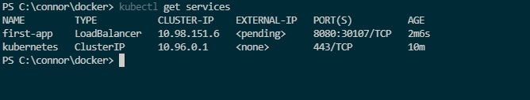

Must build an image to run on the cluster

    docker build -t 186-first-kub .

to push to docker hub must tag with docker hub repo name 

    docker tag 186-first-kub cfech/first-kub:[version optional]

    docker push cfech/first-kub

----------------- Imperative creation example ------------------------

Start the kubernetes cluster to start the master node 

    kubectl create (shows help)

Kubernetes cluster runs in a vm so we cant just give it an image from our local machine, must pull it from a registry 

    kubectl create deployment first-app --image=cfech/first-kub
    [       cmd       ] [name of deployment ] [image location]

Shows the deployments

    kubectl get deployments

Show all pods 

    kubectl get pods

To delete deployments

    kubectl delete deployment [deployment name]

188 --------
To expose a pod to the outside world we need a service, Pods have an internal IP by default but it changes when the pod is replaced

2 problems, cant use internal ip to access from outside the cluster and 2 it will change when the pod is replaced

Cant rely on the pod to keep the same ip address. 

Service groups pods and gives them a shared ip address that wont change, and we can expose this address to the web. 

To expose a pod created by a deployment run This will create the necessary service

    kubectl expose deployment first-app --type=LoadBalancer --port=8080
   [ cmd   ]       [type] [deployment name] [use a load balancer for unique address for the service] [port exposed by project]

load balancer is only available if the infrastructure supports it (AWS and minikube do support it)

To see running service

    kubectl get services

This will show us the services running and their internal/external IP's if using aws we would see an ip instead of pending but minikube is a vm on our host machine so does not have that capability

for local development we can get around that by 

    minikube service first-app
                    [app name]

will run a local host type server with a 127.0.0.1 ip

190 ------------ Restarting containers --------------

If your container has an error and crashes kubernetes will restart our container. This is a behavior of our deployment. We want 1 pod(container) always running so it will match the required state.

can reproduce this by using the demo project in 186_first-kubernetes following the steps above (or just us my image on docker hub if still there) and launching the pod and adding a service with a load balancer, then navigating to the /error page which causes a crash, then back in cmd/terminal run

    kubectl get pods 

a couple times to see the different states of the pod. 

191 --------- Scaling in action --------------------------

Can scale up a deployment by 

    kubectl scale deployment/first-app --replicas=3
    [    cmd ] [deployment/name]      [have 3 pods at all times]

Then can check with 

    kubectl get pods

    
Scales back down 

    kubectl scale deployment/first-app --replicas=1

192  ------------------ Updating deployments -----------------

rebuild and re push image 

    kubectl set image deployment/first-app first-kub=cfech/first-kub:tag
    [cmd           ]   [deployment name]  [current conatiner] = [new image]

kubectl will only pull images with new tags

check rollout status

    kubectl rollout status deployment/first-app

193 Deployment rollbacks and history

