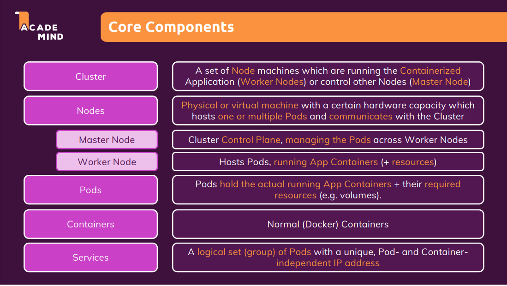
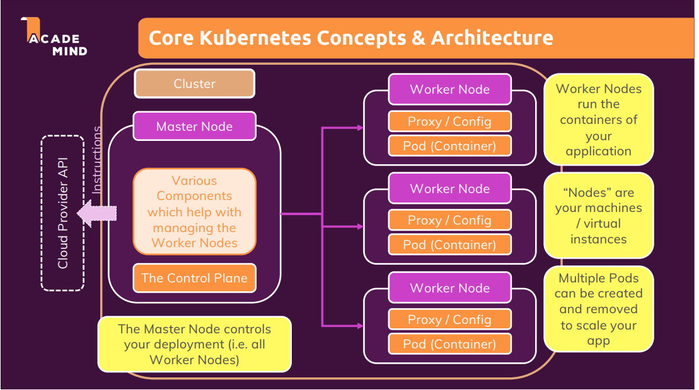
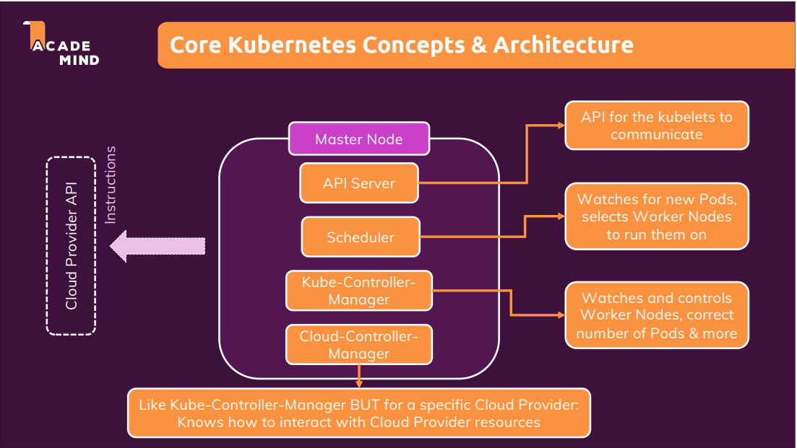
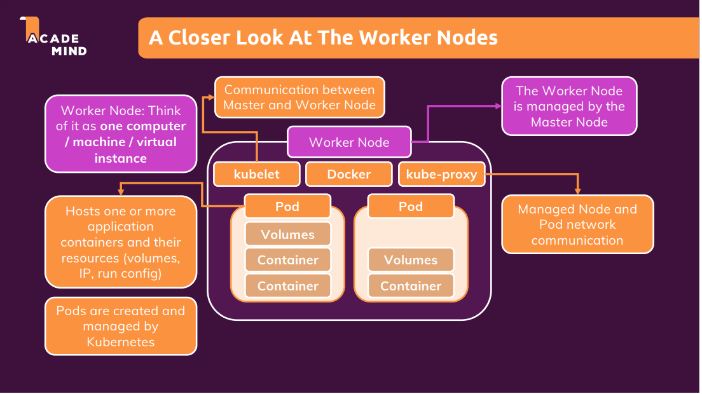
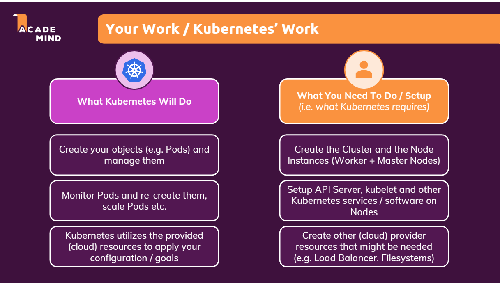
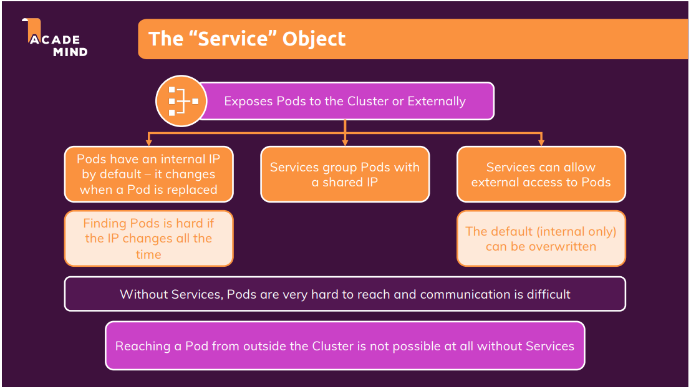
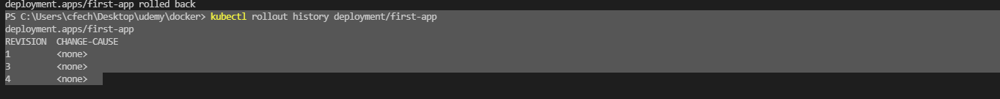
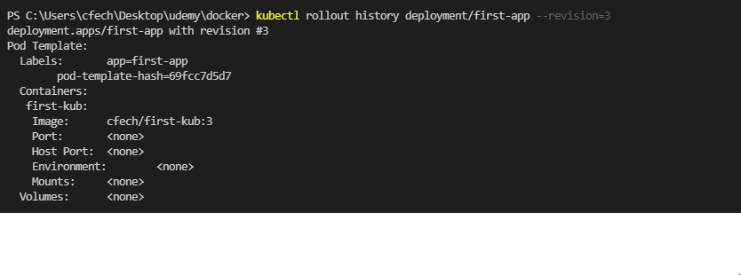

# Docker 

docker course 

https://www.udemy.com/course/docker-kubernetes-the-practical-guide/
- [Shell Commands](#shell-commands)
- [Section 3 Volumes Envs And Args](#section-3-volumes-envs-and-args)
  * [Unnamed and Anonymous Volumes](#unnamed-and-anonymous-volumes)
  * [Names Volumes](#names-volumes)
  * [Bind Mounts](#bind-mounts)
  * [Environment Variables](#environment-variables)
- [Section 4 Networking](#section-4-networking)
- [Section 5 Multi Container Apps](#section-5-multi-container-apps)
  * [Running Multi Container Apps On The Same Network](#running-multi-container-apps-on-the-same-network)
  * [Running Mongo DB With A Named Volume](#running-mongo-db-with-a-named-volume)
  * [Volumes And Binds For The Backend](#volumes-and-binds-for-the-backend)
  * [Volumes And Binds For frontend](#volumes-and-binds-for-frontend)
- [Section 6 Docker Compose](#section-6-docker-compose)
- [Section 7 Utility Containers And Executing Commands In Containers](#section-7-utility-containers-and-executing-commands-in-containers)
  * [Building Utility Container](#building-utility-container)
  * [Entry Points](#entry-points)
  * [Run With Docker Compose](#run-with-docker-compose)
- [Section 8 More Complex Multi Container Setup With PHP And Laravel](#section-8-more-complex-multi-container-setup-with-php-and-laravel)
- [Section 9](#section-9)
- [Deploying to AWS](#deploying-to-aws)
  * [Steps To Deploy A Container To An EC2 From Docker Hub](#steps-to-deploy-a-container-to-an-ec2-from-docker-hub)
  * [Adding Image To Docker Hub](#adding-image-to-docker-hub)
  * [Configuring Security Groups](#configuring-security-groups)
  * [Updating Image Running On An EC2](#updating-image-running-on-an-ec2)
  * [Shutting Down The Container](#shutting-down-the-container)
  * [AWS Billing / Free Tier / Stopping an Instance](#aws-billing---free-tier---stopping-an-instance)
  * [Deploying to ECS](#deploying-to-ecs)
- [Section 11 Kubernetes](#section-11-kubernetes)
  * [Nodes](#nodes)
  * [Master Node](#master-node)
  * [Worker Nodes](#worker-nodes)
- [Section 12 Installing Kubernetes](#section-12-installing-kubernetes)
  * [Installing Kubernetes (Windows)](#installing-kubernetes--windows-)
  * [Running Kubernetes With Kubectl And Minikube](#running-kubernetes-with-kubectl-and-minikube)
  * [Kubernetes Objects](#kubernetes-objects)
    + [Pod Object](#pod-object)
    + [185 Deployment Object](#185-deployment-object)
  * [FROM  Readme 186 first Kubernetes](#from--readme-186-first-kubernetes)
    + [Imperative Creation Example](#imperative-creation-example)
    + [188 Service Object](#188-service-object)
    + [190 Restarting Containers](#190-restarting-containers)
    + [191 Scaling in action](#191-scaling-in-action)
    + [192 Updating Deployments](#192-updating-deployments)
    + [193 Deployment Rollbacks and History](#193-deployment-rollbacks-and-history)

# Shell Commands #

 Show all running containers

    docker ps

Show all containers

    docker ps -a 

build the image, the t is a tag,. the . tells docker the correct docker file is in the current directory
 
    docker build . -t nodeappsetup_20

run a container with the image nodeappsetupe_20 and map local pro 80 to container port 80

    docker run -p 80:80 nodeappsetup_20

start an old container

    docker start --id or name---

will run in detached mode so we are no listening on the console and our console is not blocked
    
    docker start/run -d 

can re-attach ?maybe
    
    docker attach --container name---

can see logs of a container 

    docker logs --container name---

reattach  in a different way

    docker logs  -f --container name---

removing containers

    docker rm --name(s) name1 name 2

removes all stopped containers at once
    
    docker container prune 

shows all images

    docker mages

to remove images 

    docker rmi --image id, 1,2, 3, ...-- 

removes all images that are not tagged, add -a for all 

    docker image prune

--rm remove the container when when stopped

    docker run (image) --rm 

inspect all the config and info of the image
    
    docker image inspect --id----

docker cp can copy files into a container from local machine (dummy is local file)

    docker cp dummy/. --container name--:/test (:/ path we want )

copy from container to local
    
    docker --container name--:/test  dummy

give tags to images and names to containers, --name give the container a name

    docker run -p 80:80 --name 20_node -t 20_appsetup

giving a tag to image 

    docker build . -t 20_appsetup

 clones old image with a new tag, doesn't rename

                (old)               (new)
    docker tag ass1nodeapp:latest  cfech/node-hello-world

login to docker hub
    docker login 

logout of docker hub

    docker logout 

pushes to docker hub

                (path can be found in docker hub repo)
    docker push cfech/node-hello-world

gets this image from the registry(docker hub), will pull the latest version

    docker pull cfech/node-hello-world

# Section 3 Volumes Envs And Args #
- 44 realNodeApp
*Adding dockerignore files and ignoring files (e.g.) any local node modules we don't need will speed up build time*

## Unnamed and Anonymous Volumes

#Connects a folder inside the container to a folder outside the container on host machine, have to enable cross device link

(inside container)

VOLUME [ "/app/feedback" ] 

    docker volume ls  

--shows all volumes, an unnamed volume is an anonymous volume and will always go away when the container is shutdown, volumes are actually stored somewhere in the file directory and managed by docker

## Names Volumes ##
Named volumes -- not deleted when container is removed

-v says store the /app/feedback in a volume on our local machine named feedback

    docker run -p 3000:80 --rm --name feedback-node-rm --name feedback-node-44 -v feedback:/app/feedback  -t feedback-node

## Bind Mounts ##

Bind mounts - allow us to bind the container to a folder on the desktop and when code is edited in th bound folder update it in the container

#quick ways to get current folder 

-v "%cd%":/app - windows

-v $(pwd):/app -mac/linux

Bind will override what is in the folder that we bind to , in this case it is the 2nd -v saying bind this folder to /app in the container, that is where our node modules are held in the npm install step, so now if we override that folder they will be gone

    docker run -p 3000:80 --rm --name feedback-node-44 -v feedback:/app/feedback -v "C:\Users\cfech\Desktop\code\udemy\docker\44_realNodeApp:/app" -t feedback-node

Solve this problem by adding a 3rd -v using an anonymous bind docker will save the app/node_modules folder for us to use because it is a longer relative path inside the container 

    docker run -p 3000:80 --rm --name feedback-node-44 -v feedback:/app/feedback -v "C:\Users\cfech\Desktop\code\udemy\docker\44_realNodeApp:/app" -v /app/node_modules -t feedback-node

Now we can update the source code and it will copy over to our docker container because of -v #2 

    docker volumes --help 
    
to find out more 

can make binds read only by adding :ro after the :/app

4th v allows us to edit the /app/temp folder other wise we wouldn't be able to with the :ro option on the 2nd volume

    docker run -p 3000:80 --rm --name feedback-node-44 -v feedback:/app/feedback -v "C:\Users\cfech\Desktop\code\udemy\docker\44_realNodeApp:/app:ro" -v /app/node_modules -v /app/temp -t feedback-node

## Environment Variables ##

Here we can set the port env in the cli as well,  using --env (or -e), we must also expose the correct port in the -p flag for this to work

    docker run -p 3000:8000 --env PORT=8000 --rm --name feedback-node-44 -v feedback:/app/feedback -v "C:\Users\cfech\Desktop\code\udemy\docker\44_realNodeApp:/app:ro" -v /app/node_modules -v /app/temp -t feedback-node

--------------------- Environment Variables ------------------

There are also build arguments that allow us to set a default but then also change with the --build-arg tag without changing the docker file ie: having 2 different ports for prod and dev

# Section 4 Networking #
- 67 Networking

*Adding dockerignore files and ignoring files (e.g.) any local node modules we don't need will speed up build time*

will pull the latest mongo image from docker hub and run a container with it

    docker run mongo

Misc Commands

    docker build -t networking .

    docker run --name networking --rm -p 3000:3000 -t networking

---------------------------------------- Must create a network------------------

See all networks

    docker network ls 

Create a network

     docker network create favorites-net

---------------------- Running containers on the same network --check app.js for connection string

Connection string with ip :

    mongodb://172.17.0.2:27017/swfavorites

Connection string with container name (works if on the same network)

    mongodb://mongodb:27017/swfavorites

Starting the db container and connecting to the network

    docker run -d --name mongodb --network favorites-net  -t mongo

Starting the app and connecting to the network

    docker run --name networking --rm -p 3000:3000 --network favorites-net -t networking

# Section 5 Multi Container Apps #
- 80 MultiContainer 

FOR DOCKER CONTAINER COMMUNICATION WE MUST EITHER EXPOSE THE PORTS TO LOCAL HOST OR PUT THEM ALL ON THE SAME NETWORK OR BOTH

runs the mongo db db, exposing -p 27017 which is the default for the image

    docker run --rm -d --name mongodb -p 27017:27017  mongo

Build the backend image
    
    docker build backend -t 80backend

Run the backend image

    docker run -p 80:80 -d --name 80backend --rm -t 80backend

use to connect to db instead of local host 

    host.docker.internal

ex

    'mongodb://host.docker.internal:27017/course-goals'

Docker the React SPA

    docker build frontend -t 80frontend

Run the SPA, must have the -t here 

    docker run --name 80frontend --rm -d -p 3000:3000 -t 80frontend

## Running Multi Container Apps On The Same Network ##

create the network

    docker network create 80-goals-net

Run mongodb

    docker run --rm -d --name mongodb --network 80-goals-net mongo

Run the backend ,  have to expose the port for the frontend, running in the browser, to communicate with and the network for the mongodb container to communicate with

    docker run  --name 80backend --rm -d -p 80:80 --network 80-goals-net -t 80backend

Must also put the connection string in backend to the name of the container ex (mongodb is the name of our container).

    'mongodb://mongodb:27017/course-goals

Run the front end, we don't need the network fro the frontend because the front end runs in the browser and the dev server that is in the container doesn't need to communicate with our other containers

    docker run --name 80frontend --rm -p 3000:3000 -it 80frontend

 ## Running Mongo DB With A Named Volume ##

 This will allow us to persist data in our database

    docker run --rm -d --name mongodb -v data:/data/db --network 80-goals-net mongo

This will not create a username and password for this mongo db instance

*DON'T CHANGE THE PASSWORD AFTER THE 1ST CONTAINER AS IT SEEMS TO BE BOUND THE TO NAMED VOLUME, HAVE TO RESEARCH HOW TO CHANGE PASSWORD, PROBABLY ON MONGO DOCKER HUB PAGE*

    docker run --name mongodb -v data2:/data/db -d --network 80-goals-net -e MONGO_INITDB_ROOT_USERNAME=test -e MONGO_INITDB_ROOT_PASSWORD=test -t mongo 

## Volumes And Binds For The Backend ##

Adding volume for logs to backend so we save he logs after termination

    docker run -v logs:/app/logs  -d --name mongodb -v data:/data/db --network 80-goals-net mongo

Working with bind mounts, named and anonymous volumes 

    docker run -v
    C:\Users\cfech\Desktop\code\udemy\docker\80_multiContainer\backend:/app -v logs:/app/logs -v /app/node_modules --name 80backend -d -p 80:80 --network 80-goals-net -t 80backend

Bind mount for the source code to the work directory of the docker container, this will copy all files into the container when the source code it changed,

*Note about bind mounts, the longer in container path will persist so when we see /app/node_modules they will persist inside the container even if source code is change because /app/node_modules is a longer in container path than just /app

     -v C:\Users\cfech\Desktop\code\udemy\docker\80_multiContainer\backend:/app 
 
 Named volume for logs so the logs persist
 
    -v logs:/app/logs 
 
 Anonymous volume the node modules so they are not overridden in the copy phase

    -v /app/node_modules 
 

Name the container 80backend

    --name 80backend 
 
 Run in detached mode

    -d 
 
 Expose external port 80 from internal port 80

    -p 80:80 
 
 Connect to goals -net

    --network 80-goals-net 
 
 The image to use

    -t 80backend

*Careful with spacing*

Will populate the environment variable in our code to pass db info to it, an add password if needed

    docker run -v C:\Users\cfech\Desktop\code\udemy\docker\80_multiContainer\backend:/app -v logs:/app/logs -v /app/node_modules -e MONGODB_USERNAME=test -e MONGODB_PASSWORD=test --name 80backend -d -p 80:80 --network 80-goals-net -t 80backend

Sets environment variables

    MONGODB_USERNAME=test

    MONGODB_PASSWORD=test

## Volumes And Binds For frontend ##

-v will bind the source code to the docker container for live source code updates 

*will not work on windows if not using a linux file system*

    docker run -v C:\Users\cfech\Desktop\code\udemy\docker\80_multiContainer\frontend\src:/app/src --name 80frontend --rm -p 3000:3000 -it 80frontend

*Adding dockerignore files and ignoring files (e.g.) any local node modules we don't need will speed up build time*

# Section 6 Docker Compose #
- 91 dockerCompose
*VIEW THE DOCKER-COMPOSE.YML FILE IN 91_DOCKER COMPOSE FOR MORE INFO*

**DOCKER COMPOSE DOES NOT REPLACE THE DOCKER FILE BUT WORKS IN CONJUNCTION WITH IT TO BUILD MORE COMPLEX MULTI CONTAINER PROJECTS WHERE MULTIPLE CONTAINERS MUST TALK TO EACH OTHER. IT ALSO REMOVES THE NEED FOR LONG CLI COMMANDS**

start a docker compose

finds and builds all images , starts a custom network and attaches all containers to it 

    docker-compose up

 Starts in detached mode

    docker compose up -d

brings the whole network down and prunes containers and networks

    docker-compose down

 Will remove the volumes as well

    docker-compose down -v

Will rebuild all images in docker compose (ie: if there is a code change or something the bind mount doesn't pick up)

    docker-compose up --build

Will just build the missing images but not start the containers

    docker-compose build

# Section 7 Utility Containers And Executing Commands In Containers #
- 102 Utilities

Run a container with node in it 

    docker run -it node

Run in default command

    docker run -d-it node

Docker exec allows us to execute a command inside a running container 

Here we say run npm init [container name] in interactive (-it) mode

    docker exec -it  keen_benz npm init

Run node and override default CMD

    docker run -it  node npm init

## Building Utility Container ##
- see docker file in project

    docker build -t node-util .

Start the docker container with a bind mount, this will allow us to run npm init inside the container and use the bind mount to share the package.json file to our home directory from inside the docker file, in essence than never needing node on our host machine to run npm init - makes this a utility container, more useful when we need a lot of things installed to setup projects

    docker run --name node-util -v C:\Users\cfech\Desktop\code\udemy\docker\102_Utilities:/app  -it node-util npm init

## Entry Points ##

 Now we just append init because of our npm entry point, no need to have the npm (and it wouldn't work) (see entrypoint in docker file)

    docker run --name node-util -v C:\Users\cfech\Desktop\code\udemy\docker\102_Utilities:/app  -it node-util init    

Could install too

    docker run -v C:\Users\cfech\Desktop\code\udemy\docker\102_Utilities:/app  -it node-util install express

## Run With Docker Compose ##
     
docker-compose run (service) (cmd to be appended to entry point)

     docker-compose run --rm(optional) example init

# Section 8 More Complex Multi Container Setup With PHP And Laravel 

Refer to 111_dockerLaravelPhp readme for more info

# Section 9 

# Deploying to AWS #

Bind mounts are not for production, only for development not production. They are useful because we don't have to rebuild the image with each code change

In production the container should be stand alone, no code should be needed from the outside. So when we build for production we always user COPY instead of bind mounts

## Steps To Deploy A Container To An EC2 From Docker Hub ##
*Note: EC2 is your own managed machine, so the user is responsible for security, keeping the machine updated/compliant, scale etc ..*

1. Go to https://aws.amazon.com/ create account/sign into the console. (Would need a credit card)

2. Services -> EC2

3. Launch instance -> user "Amazon Linux 2 AMI (HVM)" 64 bit. 

4. Choose size of instance 

5. Configure instance (ensure there is a VPC selected in the network section)

6. Review and Launch

7. Generate new key pair, download and save in a safe spot (used for shh)

8. After launching go to Instances, select checkbox next to the instance you want and click connect. 

9. Read about ssh and copy the connection string in the popup window. 

10. Open an ssh capable terminal (mac and linux support natively windows may or may not)

11. Enter the connection string, should look something like 

        ssh -i "keyfile.pem" ec2-user@ec2-1-1-1-1.us-east/west-#.compute.amazonaws.com

        ssh -i "keyfile" ec2-user@ec2-your ip address.country-region-number.compute.amazonaws.com

12. Type in yes

13. When connected you will see your terminal look like 

        [ec2-user@your-ip ~]

*If unable to connect by ssh you may have to configure inbound rules in security groups to allow inbound traffic on port 22, should be set by default tho*

14. In ssh enter

        sudo yum update -y

to ensure all packages are up to date 

15. Install docker on EC2 Instance 

        sudo amazon-linux-extras install docker

*if this fails you may need to configure security groups to allow outbound traffic, should allow all by default though*

16. Start the docker service

        sudo service docker start

17. Can ensure docker is running by checking with 

        docker ps

Should see the docker headings. No containers are yet running. 

18. We now have 2 options to get our image onto EC2

    A. Copy all the source code onto the ec2 instance and build the image there

    B. Build the image on our local machine and push it to a registry (such as docker hub) and just pull it into our image

## Adding Image To Docker Hub ##

*open a new terminal, not in ssh*

1. Go to docker hub and create a repo

2. Building the image for docker hub, must give a tag with the docker hub repo name

        docker build -t node-aws-example .

3. Re-tag the image with docker hub username/repo-name

    docker tag node-aws-example cfech/node-aws-example

4. Push to docker hub

    docker push cfech/node-aws-example

*If this fails you may need to login to docker hub account with 'docker login'*

--------------------------------------------------------------------------------------

*Back in ssh*

19. Once the image is in the repo we can run our container on the EC2 instance with

        sudo docker run -d --rm --name awsexample -p 80:80 cfech/node-aws-example

        sudo docker run -d --rm --name [your container name] -p 80:80 [your image name on docker hub]

This will check the local docker cache and check if there is a copy of this image, if not it will reach out to docker hub and pull it down and run the container (as long as repo isn't private, for private repos/registries there may be some sort of login component.)

## Configuring Security Groups ## 

Before we can view our webpage on the internet we must allow inbound http traffic. 

1. Check to see what security group the EC2 instance is in. It will usually be right in the information of the instance. 

2. Go to that security group and select Inbound Rules (could also config outbound) -> Edit inbound rules -> add rule

3. Select type (in our case http, could also config https, ssh etc... here), protocol and port should auto populate

4. Select source (in our case anywhere on ipv 4 but could put custom config here) and save rules.

---

20. Now we can check our service by navigating to the IP address of the server, found in the instances page of aws.

## Updating Image Running On An EC2 ##

1. To update an image , rebuild and repush to docker hub as shown in the steps above

2. In ssh 

    
        sudo docker ps

to see running containers 

    sudo docker stop [container name ]

to stop the container

3. Update the image in the EC2 instance 

        sudo docker pull cfech/node-aws-example [your image name]

4. Rerun the container 

        sudo docker run -d --rm --name awsexample -p 80:80 cfech/node-aws-example

        sudo docker run -d --rm --name [your container name] -p 80:80 [your image name on docker hub]

## Shutting Down The Container ##

Run 

    sudo docker stop [container name]

## AWS Billing / Free Tier / Stopping an Instance ##

Aws free tier is limited and you can incur charges when using it if your leave your instances running constantly, especially if they are in an auto scale or load balancing group

If not a prod environment you should verify your instance is not in either of these groups, review the free tier allotments per month, and pause/stop the instance when not using it to avoid fees. You can monitor fees/ track usage from the Bill and Cost Management Dashboard

To stop and instance right click it in the EC2 instances window -> stop instance
or -> terminate instance to get rid of it. If you stop an instance and it is an an auto scaling group it will spin up another copy for you so watch out for that

## Deploying to ECS ##
Much more complicated
1. Create a cluster on aws, this is where all your tasks/containers sit. There are two options EC2 where you have a whole server and must manage/secure it or Fargate where you can just deploy your containers and have them be managed by AWS. You can create a private vpc for the container if necessary.
2. Create a task definition which includes information about your container. You can store your container on docker hub, a private registry or aws Elastic Container Registry(ECR) Service
    2a. You must select a role for the task that controls the permission aws will give the task , the role "ecsTaskExecution" should be created the 1st time the container setup wizard is used
    2b. Manage cpu's/ram 
    2c. Add the container(s) you want with the docker configuration (ports, envs, volumes)
3. Create a Service on the cluster - this will run tasks based on the task definition that is selected. Here you select the task:version you want to run as well as assign load balancers, autoscaling, vpcs and sub nets. Hit create and it will launch the container(s) listed in the task definition.

*To use ECR search for it on AWS, create a repository and use the cli command to push your image. You will have to have aws cli configured for this*

# Section 11 Kubernetes #

Kubernetes is a tool that helps deploying monitor and scale docker applications.
It does not replace docker but works hand in hand with it. There are a lot of similarities to that of AWS ECS provides including scaling and monitoring health of containers, relaunching if necessary. 

## Nodes ##
---

## Master Node ##

Kubernetes works by having a master node that runs services (API Server, which talks to the kubelet service on the worker node, 2. The scheduler that watches the pods and chooses worker nodes to add need pods due to health or scaling, 3. The cube controller manager watches the worker nodes to ensure we have the correct number of pods up and running. 4. Optional - There is also a cloud controller manager that performs the same tasks but to talk to a cloud service provider ) to manage a lot of worker nodes. 

## Worker Nodes ##

The worker node is a machine (ie: ec2 instance) that host pods, pods host one or more containers and their resources such as volumes IP's and run configurations. Pods are managed by the master node. May have multiple containers inside a pod. Could have multiple pods with the same or different pods. Pods have to have some other software , docker to run docker containers, the kubelet which is responsible for communicating with the master node. And a proxy service which manages inbound and outbound network traffic.

# Section 12 Installing Kubernetes

## Installing Kubernetes (Windows) ##
Have to install kubernetes

https://kubernetes.io/releases/download/

Install: 
- Kubectl - kubernetes controller, we use this to communicate with the master node to express what we want to happen (always need this locally)

Once installed and path updated test Kubectl with to show version

    kubectl version --client

- Minikube for local development, uses a vm on local machine that holds the cluster, can be run in most hypervisors:  vmware, virtual box etc.. or a docker container

Minikube will configure kubectl to look for minikube environment, in the cloud it would be talking to the cloud provider

https://minikube.sigs.k8s.io/docs/start/

**For windows need admin privileges to install**

## Running Kubernetes With Kubectl And Minikube ##

Once minikube installed run to setup a kubernetes cluster on your machine 

    minikube start (will start by default in docker)

or 

    minikube start --driver=[virtualbox, hyper-v, etc...]

Can run  to check status of the cluster

    minikube status 

Can run to see a web dashboard of the cluster

    minikube dashboard

Other Common Cmds

    minikube pause

    minikube unpause

    minikube update-context

## Kubernetes Objects ##
### Pod Object ###
---
- Pod is the smallest unit Kubernetes interacts with, it contains and runs one (usually) or multiple containers.

- Pods contain shared resources (volumes) for all Pod containers

- Pods have cluster internal ip address that can be used to send requests to the pod. 

- Containers in the pod can communicate via localhost

- Pods are designed to be ephemeral(do not persist), all the resources in the pod are lost if a pod is replaced or moved. This a deliberate design decision.

- Containers work like this as well. Could use volumes to persist data .

- For pods managed by the user you would need a controller.

### 185 Deployment Object  ###
---

- One of the key objects we work with

- Create a deployment object which we give instructions about the number and types of pods we wish to deploy

- Controls one or multiple pods

- Set a desired target state (two pods with x containers running) and Kubernetes will do the leg work.
ie: create the containers and pods, and places the pods on worker nodes with sufficient resources to handle them

- Deployments can be paused, rolled back or deleted. IF some code has a bug we can just rollback and then fix the bug in due time

- Can use autoscaling to create/delete more pods if necessary by tracking cpu% and other metrics 

- We can create multiple deployments to having multiple different pods. We do not typically create pods by themselves. We let the deployments do that

## FROM  Readme 186 first Kubernetes  ##
---

Must build an image to run on the a container in a pod on the cluster

    docker build -t 186-first-kub .

to push to docker hub must tag with docker hub repo name 

    docker tag 186-first-kub cfech/first-kub:[version optional]

then

    docker push cfech/first-kub

### Imperative Creation Example ###
---

Start the kubernetes cluster to start the master node 

    kubectl create (shows help)

Kubernetes cluster runs in a vm so we cant just give it an image from our local machine, must pull it from a registry 

- talking to the master node 
- scheduler analyzes currently running pods and finds best node fro the new pods 

    kubectl create deployment first-app --image=cfech/first-kub
    [       cmd       ] [name of deployment ] [image location]

Shows the deployments

    kubectl get deployments

Show all pods 

    kubectl get pods

To delete deployments

    kubectl delete deployment [deployment name]

### 188 Service Object ###
---

- To expose a pod to the outside world we need a service
-  Pods have an internal IP by default but it changes when the pod is replaced, which is pretty often

- 2 problems, cant use internal ip to access from outside the cluster and 2 it will change when the pod is replaced

- Cant rely on the pod to keep the same ip address. 

- Service groups pods and gives them a shared static ip address that wont change, and we can expose this address to the web. 

**Clusters are not reachable the outside world at all without a service**

- To expose a pod created by a deployment run This will create the necessary service

    kubectl expose deployment first-app --type=LoadBalancer --port=8080
   [ cmd   ]       [type] [deployment name] [use a load balancer for unique address for the service] [port exposed by project]

Other "types" are 

1. ClusterIp - gives a default IP only accessible inside the cluster

2. NodePort - Will expose based on the IP of the worker node, can be accessed from outside

3. LoadBalancer - Utilizes and LB and generates a unique address for this service, will also evenly distribute traffic across all pods, managed by this service. 

- load balancer is only available if the infrastructure supports it (AWS and minikube do support it)

to delete 

    kubectl delete service first-app [service name]

To see running services

    kubectl get services

- This will show us the services running and their internal/external IP's if using aws we would see an ip instead of pending but minikube is a vm on our host machine so does not have that capability

for local development we can get around that by using the minikube specific service command. If we deploy on a cloud provider it should provide an external IP for us

    minikube service first-app
                    [app name]

will run a local host type server with a 127.0.0.1 ip

### 190 Restarting Containers ###
---

If your container has an error and crashes kubernetes will restart the container. This is a behavior of our deployment. We want 1 pod(container) always running so the deployment will match the required state.

can reproduce this by using the demo project in 186_first-kubernetes following the steps above (or just use my image on docker hub if still there), launching the pod and adding a service with a load balancer, then navigating to the /error page which causes a crash, then back in cmd/terminal run

    kubectl get pods 

a couple times to see the different states of the pod. 

**Kubernetes does NOT create new containers/pods. It restarts the ones that have gone down**
### 191 Scaling in action ###
---

If don't have auto scalding configured Can scale up a deployment by 

    kubectl scale deployment/first-app --replicas=3
    [    cmd ] [deployment/name]      [have 3 pods at all times]

Then can check with 

    kubectl get pods

    
Scales back down 

    kubectl scale deployment/first-app --replicas=1

### 192 Updating Deployments ###
---
rebuild and re push image to image registry

kubectl will only pull images with unique tags

    docker build cfech/first-kub:2 .

push to repo

    docker push cfech/first-kub:2

- now will have a unique tag

then can run 

    kubectl set image deployment/first-app first-kub=cfech/first-kub:tag
    [cmd           ]   [deployment name]  [current container] = [new image]

check rollout status

    kubectl rollout status deployment/first-app
                                        [deployment name]
### 193 Deployment Rollbacks and History ###
---

- if we try to use a tag (line 928) that doesn't exist it will will fail

- can roll back this update by 

        kubectl rollout undo deployment/first-app
                                        [deployment name]

- if we ant to revert to an older deployment must take a look at the deployment history

        kubectl rollout history deployment/first-app

- can get details with --revision flag

        kubectl rollout history deployment/first-app --revision=3

- to revert back to deployment revision 1

        kubectl rollout undo deployment/first-app --to-revision=1

duplicate cmds: 

        kubectl delete service first-app
        kubectl delete deployment first-app

### 194 Imperative vs Declarative Approach ###
---

- in imperative we always have to repeat the same commands
- always had to run "docker run etc..." until we started using docker compose 
- declarative allows us to write down all our k8's info into a resource definition

- could define different types of objects k8's understands, such as pods, services and deployments

called with 

        kubectl apply -f example.yml

### 195 Creating A Deployment Configuration File With Declarative Approach ###
---
- includes 196 Adding Pod and Container Specs

- see 186_first_kubernetes/deployment.yml for notes

https://kubernetes.io/docs/concepts/workloads/controllers/deployment/
https://kubernetes.io/docs/reference/

- to use this file, can have multiple -f is we want, then file path
    
    kubectl apply -f='deployment.yml'

- without a selector will get 

        error: error validating "deployment.yml": error validating data: ValidationError(Deployment.spec): missing required field "selector" in io.k8s.api.apps.v1.DeploymentSpec; if you choose to ignore these errors, turn validation off with --validate=false

### 197 Working With Labels And Selectors ###
---
https://kubernetes.io/docs/concepts/overview/working-with-objects/labels/

- selectors take in label labels of pods, these labels to the deployment which pods belong to it so that the deployment can manage them

#used to match the labels of the pods we want to be managed by this deployment

        ...
         #used to match the labels of the pods we want to be managed by this deployment
        selector:
        # for deployment we can use matchLabels or/and matchExpressions
            matchLabels:
            myApp: second-app  **XXX**
        
        #--------------- POD -------------------------
            
            ...
            
            # we need this because we will feed this label to the deployment selector in order for the deployment to be aware we want this pod(s) to be managed by it 
            labels:
            #values here can be anything we want 
                myApp: second-app XXX **XXX**

- Now we run 

        kubectl apply -f='deployment.yml'

- can check with 

        kubectl get deployments

### 198 Creating A Service Declaratively ###
---

- need a service to be able to view the deployment , see  186_first_kubernetes/service.yml

- once defined we can then create the service with:  (syntax seems to be variable)

        kubectl apply -f service.yml

                        [file/file path]

can check with 

    kubectl get services

- then must expose the service to minikube with 

        minikube service dec-service
                        [name of service]

### 199 Updating And Deleting Resources While Using Declarative Approach ###
---

- can just change your yml file and reapply it

- ie change replicas to 2 or image you want 
- major benefit is you can just change the config file and re apply it. dont have to type long commands in succession to get this done

Deleting resources: 

could still use the delete commands individually

or could call 

    kubectl delete -f deployment.yml -f service.yml
                    [file name]

### 200 Multiple Vs Single Deployment Files ###
---

- could combine service.yml and deployment.yml into the same file and create both objects there

- see ./186_first_Kubernetes/parent.yml

- could have as many resource declarations in 1 file as you want, 

- must include '---' between your resources

- best project to put service first
- a service will continually analyze all pods created in the cluster to see which ones it should be monitoring via selectors

### 201 Labels And Selectors Continued ###
---
https://kubernetes.io/docs/concepts/overview/working-with-objects/labels/

- can use matchLabels or matchExpressions

    selector:
        matchLabels:
        myApp: second-app

- matchExpression allows us to have some more control by having a list of expressions that all have to be satisfied for the pods to be managed
- expressions example, look for a key with myApp, operator (In, NotIn, Exists DoesNotExist), value of what we are looking for
    matchExpressions:
        selector:
          - {key: myApp, operator: In , values: [second-app, something-else]  }

**Could also use selectors on cli commands**
- object must have a label, 

    kubectl delete deployments,services -l group=example
                 [what types to deploy ] -l  [ labelKey=labelValue ]

### 202 Liveness Probes ###
---
https://kubernetes.io/docs/tasks/configure-pod-container/configure-liveness-readiness-startup-probes/

- how does kubernetes check if our pods and containers are healthy? 

- we can configure this if we want
- see ./186_first_kubernetes/deployment.yml 

- can add the livenessProbe to our container configuration

      ...
      containers:
      #name of our container
        - name: second-nodejs-app
          #image we want to use
          image: cfech/dec-kub
          livenessProbe: 
          # send an http get to / on port 8080 (the port our container exposes), could have extra headers if we want
            httpGet:
              path: /
              port: 8080
            #the amount of time between checks, ie every 10 seconds
            periodSeconds: 10
            # wait 5 seconds before the fist check
            initialDelaySeconds: 5

-- WHAT IS THE DEFAULT

### 203 A Closer Look At Configuration Options ###
---

- cna configure env variables,  the image, how the image is pulled and more

- if we specify latest the service will always re-pull the latest image on pod restart

        image: cfech/dec-kub:latest

        vs

        image: cfech/dec-kub

or could set imagePullPolicy: (Always, Never or Preset), will either always pull it, never pull it or only pull if not present

- if you the apply the update it will pull the new image (may need a pod restart?)

    kubectl apply -f .\deployment.yml

### 204 A Summary ###
---

# 13 Managing Data & Volumes With Kubernetes #
